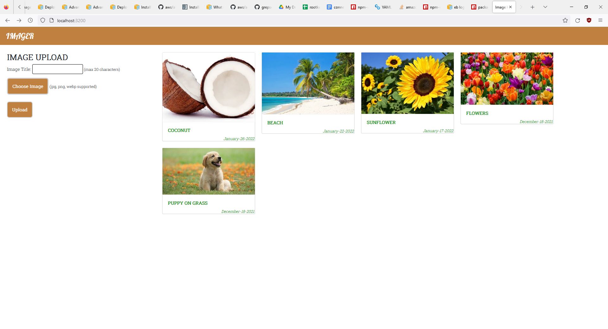

# Node.js Website
Image hosting website implemented using Node/Express.  

[Website Link](https://fathomless-wave-52759.herokuapp.com)  
[Git Repo](https://github.com/collinc1212/nodejs_website)  

## Details
* Uses MongoDB/Mongoose for storage
* REST API on the back-end for access to data
* Uses AWS S3/CloudFront for image storage and distribution
* Hosted using Heroku

